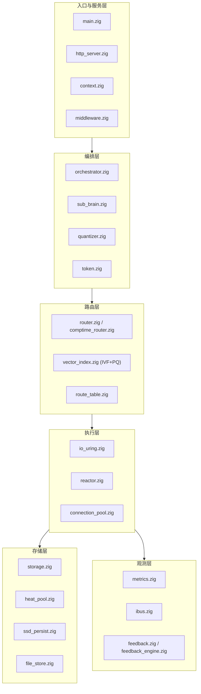

# ZigClaw-AI 🦅

[](https://github.com/CWLtoken/ZigClaw-AI)
[](https://ziglang.org/)
[](LICENSE)
[](https://github.com/CWLtoken/ZigClaw-AI/releases)

**ZigClaw-AI** 是一个基于 **Zig 0.16** 的高性能异步 AI 客服系统框架。底层采用 `io_uring`，六层静态分层，严格遵守 **"显性直白、扁平低代码、无依赖0"** 三大军规。

> 当前版本：**v3.3 — 军规驱动 + 架构师全局修复 + 编译修复**
> 测试状态：**153/153 通过** ✅

---

## 🛡️ 军规与核心特性

### 三大军规

| 军规 | 约束 | 典型做法 |
|------|------|----------|
| **显性直白** | 禁止隐式控制流与隐式依赖 | 无菌室文件禁止 `try/catch/orelse`；全部显式 `if-else`；契约与错误集在编译期校验 |
| **扁平低代码** | 扁平分层 + 零运行时查表 | 六层静态分层；Comptime 路由编译期生成 dispatch；零虚函数/零反射 |
| **无依赖0 (Zero Deps)** | 零第三方运行时依赖 | 只用 Zig 0.16 标准库 + 自包含 C 代码；C 库通过 `addLibrary + addCSourceFile` 构建 |

### 核心特性一览

| 特性 | 描述 |
|------|------|
| **🚀 io_uring 零拷贝 I/O** | 基于 Linux `io_uring`，批量提交、链式操作、延迟提交策略 |
| **🧠 多模态编排** | 文本直通 + 向量量化，子脑注册表按模态调度；当前支持 LongCat 长上下文拼接 |
| **📊 IVF+PQ 向量检索** | 256 维向量 IVF 倒排索引 + 乘积量化，**静态内存零堆分配** |
| **🔍 内省总线** | IBus 5 层指标原子记录 + JSON 零堆序列化 + 二进制指标协议 |
| **🔄 反馈学习引擎** | SimpleLearner 硬编码规则，实时生成优化建议；观测数据反哺编排，形成学习飞轮 |
| **💾 文件存储后端** | `FileStore` 基于 `io_uring.Syscall` 文件 I/O，零堆分配 |
| **⚡ 缓存行对齐** | `AlignedAtomicU64` 消除伪共享，多核性能无损 |
| **🔀 Comptime 路由** | 编译期生成路由 dispatch，零运行时查表开销 |
| **🔒 编译期契约验证** | `ContractVerifier` 完整签名检查（返回类型 + 参数类型 + ErrorSet 子集） |
| **🔌 连接池复用** | 纯状态机连接池，降低跨区 LLM 握手延迟 |
| **🧪 错误注入测试** | 覆盖 `io_uring` 初始化失败 / EAGAIN / 磁盘满 / 连接中断 |
| **🏗️ 军规级构建系统** | `addLibrary` + `addCSourceFile`，编译期配置注入（如 `batch_threshold`） |

---

## 🏛️ 架构总览（六层静态分层）

系统严格划分为六层，依赖方向单向向下，**禁止跨层直调**。层间交互通过 `interface.zig` 的 `comptime` 契约强制校验。



### 各层职责与特点

| 层 | 核心文件 | 职责 | 特点 |
|----|----------|------|------|
| **L1 入口与服务层** | `main.zig` / `http_server.zig` / `context.zig` / `middleware.zig` | HTTP/TLS 终止、多租户上下文隔离、请求准入 | 基于 `io_uring` 的零拷贝解析；多租户 `X-Tenant-ID` 强制校验 |
| **L2 编排层** | `orchestrator.zig` / `sub_brain.zig` / `quantizer.zig` / `token.zig` | 多模态输入统一化、子脑分发、推理调度 | 当前：多模型特征向量提取 + LongCat 长上下文拼接；下一阶段：**统一离散 Token**，将连续向量通过 VQ-VAE/LCG 码本强制离散化，抹平模态差异 |
| **L3 路由层** | `router.zig` / `comptime_router.zig` / `vector_index.zig` / `route_table.zig` | 超大规模向量极速检索 | **256 维 IVF+PQ 向量索引**：倒排桶 + 乘积量化，静态内存零堆分配；Comptime 路由表编译期展开与校验 |
| **L4 执行层** | `io_uring.zig` / `reactor.zig` / `connection_pool.zig` | 硬件级暴力计算与 I/O 调度 | **寄宿在 CPU 缓存**：高频状态机 `ConnSlot` 严格 `align(64)` 缓存行对齐；**原子无意识 Agent**：无锁、无同步原语；**暴力乱序执行**：`io_uring` 批量延迟提交，`BATCH_THRESHOLD` 编译期注入 |
| **L5 存储层** | `storage.zig` / `heat_pool.zig` / `ssd_persist.zig` / `file_store.zig` | 冷热数据分级持久化 | 热池常驻内存，冷数据直落 SSD；文件 I/O 全量走 `io_uring` 异步提交，与网络 I/O 共享同一 Reactor |
| **L6 观测层** | `metrics.zig` / `ibus.zig` / `feedback.zig` / `feedback_engine.zig` | 系统内省、指标暴露、学习闭环 | **学习反馈飞轮**：延迟/错误分布通过 IBus 反向注入编排层，让大模型在推理时动态调整路由权重与 Self-Reflection 策略 |

---

## 🧪 测试体系

- **测试统计**：**153/153 全绿** ✅
- **核心模块内联测试**：`token` / `quantizer` / `heat_pool` / `vector_index` / `ibus` / `feedback_engine` / `comptime_router` / `app_router` 等
- **集成测试**：P3–P60 + `comptime_router` + `app_router` + **错误注入（`fault_injection`）**
- **编译期守卫**：`SyscallError` 完整性、`Ring.init` 返回类型、`AlignedAtomicU64` 对齐、`ConnSlot` 大小等

---

## 🚀 快速开始

### 环境要求

- **Zig**：0.16.0
- **系统**：Linux with `io_uring`（Kernel ≥ 5.1）

### 关键命令

```bash
# 克隆仓库
git clone git@github.com:CWLtoken/ZigClaw-AI.git
cd ZigClaw-AI

# 切换到 agent 分支（如需要）
git checkout agent

# 运行全部测试
zig build test

# 编译期配置（自定义 BATCH_THRESHOLD）
zig build -Dbatch_threshold=16

# 构建并运行
zig build run
```

---

## 📋 军规与约束（摘要）

1. **第一诫：精确导入**
   ✅ `const mem = @import("std").mem;`
   ❌ `const std = @import("std");`（非测试文件）

2. **第二诫：无菌室原则**
   无菌室文件（`reactor.zig`、`io_uring.zig`、`protocol.zig`）禁止 `try/catch/orelse`，必须显式 `if-else` 错误处理。

3. **第三诫：零第三方库**
   全部使用 Zig 0.16 标准库，禁用任何第三方依赖。

4. **第四诫：静态分配优先 + 依赖引入评审**

5. **第五诫：CI 必须 ReleaseSafe + 军规检查**

6. **第六诫：构建系统军规**
   使用 `addLibrary` + `addCSourceFile`，禁止 `addSystemCommand`；编译期配置通过 `b.option` + `addOptions` 注入。

7. **第七诫：类型安全（v3.3 新增）**
   ❌ `val as usize`（整数→usize 转换）→ ✅ `@as(usize, @intCast(val))`
   ❌ `const a, _ = fn()`（struct tuple 逗号解包）→ ✅ `const s = fn(); const a = s[0];`

---

## 📈 演进路线：Zig 0.17 + LongCat 正式发布

> 从 v3.3 军规基线出发，后续演进聚焦两条主线：**Zig 0.17 迁移** 与 **LongCat 正式发布**。

1. **Zig 0.17 迁移**
   - 在 0.17 下重新验证军规：显性直白 / 无菌室 / 无依赖0。
   - 适配新标准库与构建系统变更，确保 `io_uring` + `comptime` 路由等特性不变。
   - 目标：在 0.17 上达到与 0.16 相同的军规执行度与测试覆盖率。

2. **LongCat 正式发布**
   - 编排层：从"多模型向量提取 + LongCat"升级为 **统一离散 Token**，将连续向量通过码本强制离散化，实现文本/图像/视频统一上下文窗口。
   - 路由层：继续强化 IVF+PQ 256 维向量检索，保持静态内存零堆分配特性。
   - 观测层：将 IBus 反馈数据与 LongCat 调度策略深度结合，形成更紧密的学习飞轮。

3. **性能与可靠性深化**
   - 引入更完整的错误注入与性能回归 CI，覆盖 io_uring 失败、磁盘满、网络中断等极端场景。
   - 在高并发场景下持续压测 `reactor` + `connection_pool` 的延迟与稳定性。

---

## 🤝 贡献指南（精简）

1. **遵循军规**：无菌室 + 精确导入 + 零第三方库。
2. **测试驱动**：新功能必须附带测试，保持全绿。
3. **分层设计**：明确层级归属，禁止循环依赖。
4. **错误注入**：新增核心路径必须覆盖错误场景。

提交规范建议：`<type>(<scope>): <subject>`，例如：
- `feat(orchestrator): add unified discrete token support`
- `fix(reactor): make flush call sites explicit`
- `test(vector_index): add ivf+pq boundary tests`

---

## 📜 许可证

MIT License。详见 [LICENSE](LICENSE) 文件。

---

**ZigClaw-AI** — *从 io_uring 泥泞层到智能编排层，每一行都经过第一性原理优化。v3.3 军规全面合规，153/153 测试全绿。*
